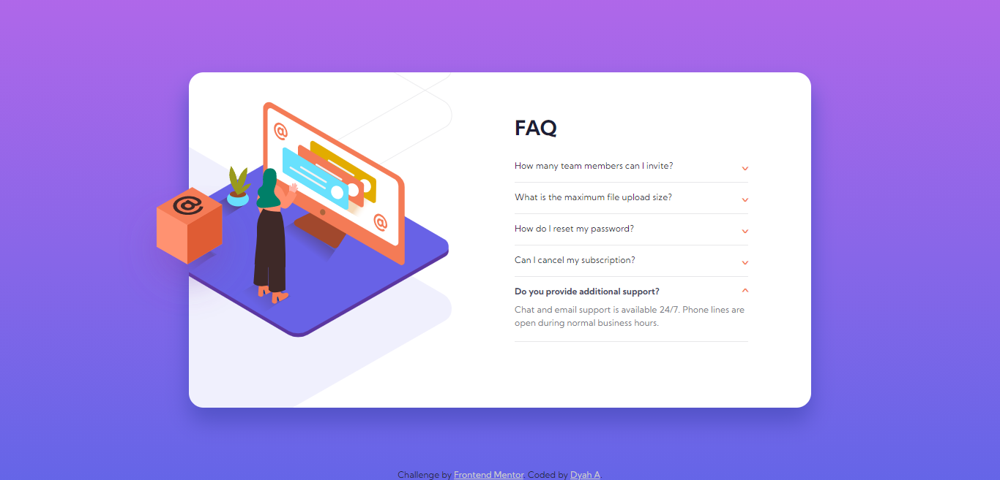

# Frontend Mentor - FAQ accordion card solution

This is a solution to the [FAQ accordion card challenge on Frontend Mentor](https://www.frontendmentor.io/challenges/faq-accordion-card-XlyjD0Oam). Frontend Mentor challenges help you improve your coding skills by building realistic projects. 

## Table of contents

- [Overview](#overview)
  - [The challenge](#the-challenge)
  - [Screenshot](#screenshot)
  - [Links](#links)
- [My process](#my-process)
  - [Built with](#built-with)
  - [What I learned](#what-i-learned)
  - [Continued development](#continued-development)
  - [Useful resources](#useful-resources)
- [Author](#author)

## Overview

### The challenge

Users should be able to:

- View the optimal layout for the component depending on their device's screen size
- See hover states for all interactive elements on the page
- Hide/Show the answer to a question when the question is clicked

### Screenshot

- On Desktop

- On Mobile

### Links

- Solution URL: [GitHub](https://github.com/arumdyaharum/FeM_faqAccordion)
- Live Site URL: [GitHub Pages](https://arumdyaharum.github.io/FeM_faqAccordion/)

## My process

### Built with

- Semantic HTML5 markup
- CSS custom properties
- Flexbox
- Mobile-first workflow
- VanillaJS

### What I learned

This is my first time doing frontend development. I learned how to get used to design a website, first time using javascript, and also first time using Github.

### Continued development

I want to practice my design skill using HTML and CSS. I still overwhelmed writing Javascript code so I will keep learning Javascript.

### Useful resources

- [Building an accordion by Coder Coder](https://www.youtube.com/watch?v=FboXxLxg8eo) - This is the reason I sign up Frontend Mentor.
- [FAQ accordion by Sam Codes](https://www.youtube.com/watch?v=WB4qM9Umzss) - I was only looking for javascript which making accordion menu once at the time.

## Author

- Frontend Mentor - [@arumdyaharum](https://www.frontendmentor.io/profile/arumdyaharum)
- GitHub - [@arumdyaharum](https://www.https://github.com/arumdyaharumm)
- Twitter - [@arumdyaharum](https://www.twitter.com/arumdyaharum)
- Instagram - [@arumdyaharum](https://www.instagram.com/arumdyaharum)
